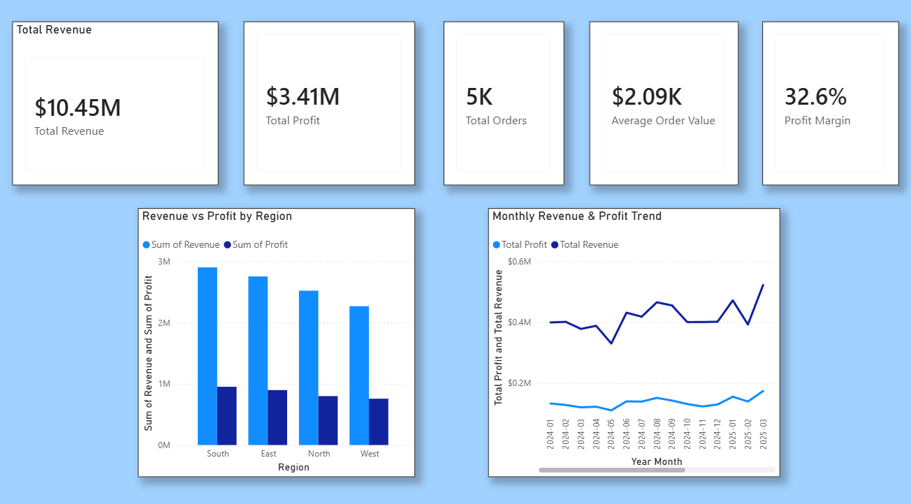
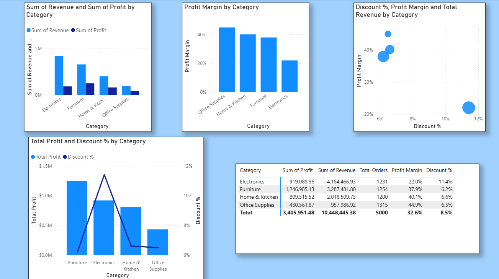
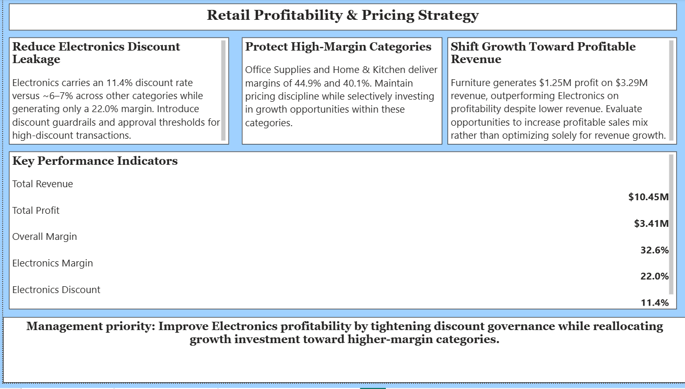

# Retail Profitability & Pricing Strategy Dashboard

An interactive Power BI dashboard designed to analyze retail revenue, profitability, discount behavior, and category performance to identify business opportunities and improve pricing strategy.

## Dashboard Preview

### Executive Overview

### Profitability Deep Dive

### Management Recommendations

---

## Key Performance Indicators

| KPI | Value |
|---|---:|
| Total Revenue | $10.45M |
| Total Profit | $3.41M |
| Total Orders | 5,000 |
| Average Order Value | $2.09K |
| Overall Profit Margin | 32.6% |

---

## Key Insights

### Electronics Discount Leakage

Electronics has the highest discount rate at **11.4%**, while generating the lowest profit margin among the major categories at **22.0%**.

This indicates potential discount leakage and suggests the need for tighter discount controls.

### High-Margin Categories

Office Supplies and Home & Kitchen demonstrate strong profitability with margins of approximately **44.9%** and **40.1%** respectively.

These categories represent attractive areas for continued growth investment.

### Furniture Profitability

Furniture generates approximately **$1.25M in profit** on **$3.29M in revenue**, demonstrating strong profitability despite generating less revenue than Electronics.

The analysis suggests focusing on profitable revenue growth rather than revenue alone.

---

## Management Recommendations

- Introduce discount approval thresholds for high-discount Electronics transactions.
- Reduce unnecessary discounting in low-margin categories.
- Protect pricing discipline in high-margin categories.
- Increase growth investment toward profitable categories such as Furniture, Office Supplies, and Home & Kitchen.
- Monitor profit margin alongside revenue when evaluating business performance.

---

## Dashboard Pages

### Executive Overview

Provides a high-level view of:

- Revenue
- Profit
- Orders
- Average Order Value
- Profit Margin
- Regional performance
- Monthly revenue and profit trends

### Profitability Deep Dive

Analyzes:

- Revenue by category
- Profit by category
- Profit margin
- Discount percentage
- Total orders
- Category-level profitability

### Management Recommendations

Converts the analysis into actionable business recommendations and highlights the most important pricing and profitability opportunities.

---

## Tools & Technologies

- **Microsoft Power BI**
- **DAX**
- **Data Modeling**
- **Data Visualization**
- **KPI Development**
- **Business Analysis**

---

## DAX Measures

The dashboard uses DAX measures including:

- Total Revenue
- Total Profit
- Total Orders
- Average Order Value
- Profit Margin
- Discount %
- Revenue YoY %
- Profit YoY %
- Revenue LY

A dedicated Date Table was also created for time-based analysis.

---

## Business Objective

The objective of this project is to help management understand:

1. Which categories generate the most profit?
2. Which categories have the highest margins?
3. Where are excessive discounts reducing profitability?
4. How are revenue and profit changing over time?
5. Where should future growth investment be focused?

---

## Project Files

- `Retail_Profitability_Dashboard.pbix` — Power BI dashboard
- `executive-overview.png` — Executive Overview
- `profitability-deep-dive.png` — Profitability Deep Dive
- `management-recommendations.png` — Management Recommendations
